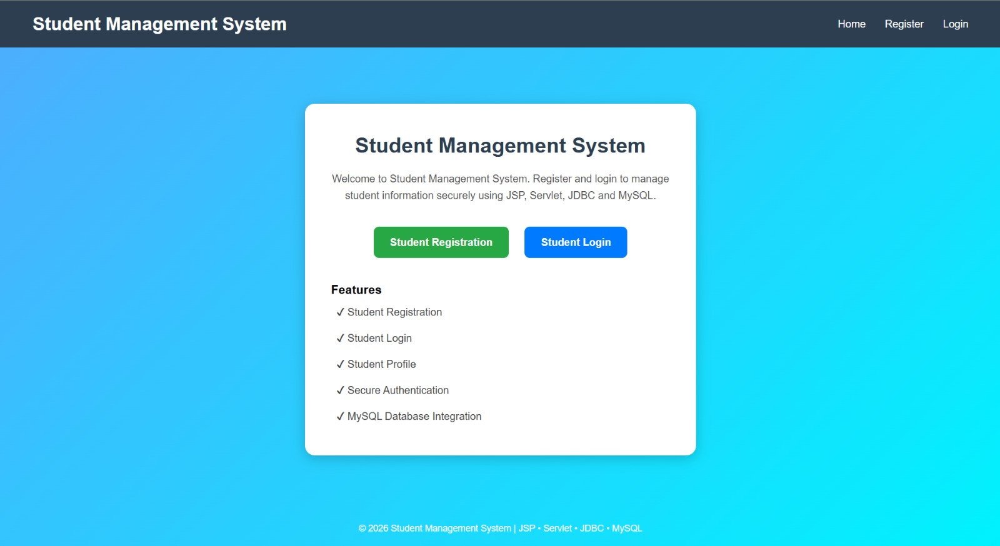
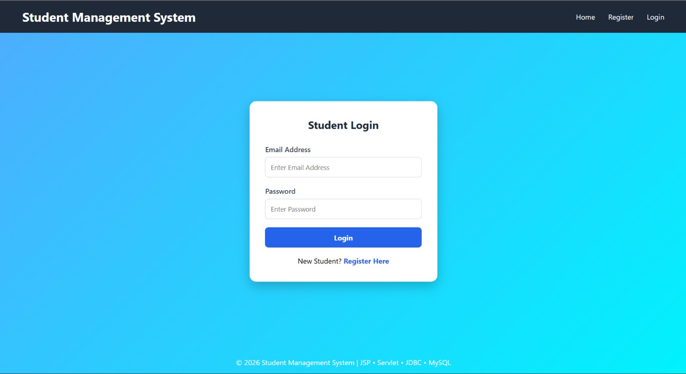
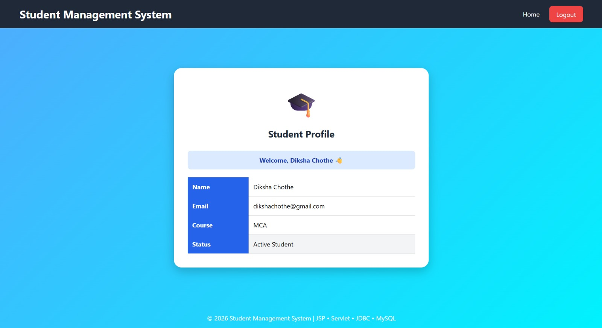
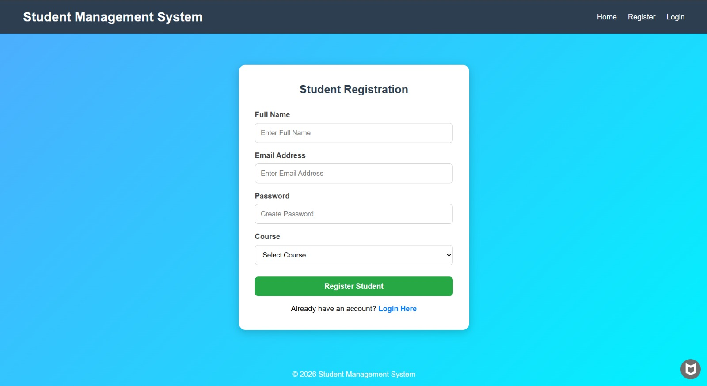

# Student Management System

A web-based Student Management System developed using JSP, Servlets, JDBC, and MySQL. This application allows users to manage student records efficiently through Create, Read, Update, and Delete (CRUD) operations.

## Features

* Add new student records
* View all student details
* Update existing student information
* Delete student records
* Database integration using JDBC
* User-friendly interface

## Technologies Used

* Java
* JSP (JavaServer Pages)
* Servlets
* JDBC
* MySQL
* HTML
* CSS

## Project Structure

* Presentation Layer (JSP)
* Controller Layer (Servlets)
* Database Layer (JDBC & MySQL)

## Database

MySQL is used as the backend database to store and manage student information.

## Learning Outcomes

Through this project, I gained practical experience in:

* Java Web Development
* MVC Architecture
* Database Connectivity using JDBC
* CRUD Operations
* Client-Server Communication

## Future Enhancements

* User Authentication & Authorization
* Search and Filter Functionality
* Pagination
* Responsive UI Design

## Author

Diksha Chothe

B.Tech Computer Science & Engineering

Aspiring Java Full Stack Developer
# Student Management System

A web-based Student Management System developed using JSP, Servlets, JDBC, and MySQL. This application allows users to manage student records efficiently through Create, Read, Update, and Delete (CRUD) operations.

## Features

* Add new student records
* View all student details
* Update existing student information
* Delete student records
* Database integration using JDBC
* User-friendly interface

## Technologies Used

* Java
* JSP (JavaServer Pages)
* Servlets
* JDBC
* MySQL
* HTML
* CSS

## Project Structure

* Presentation Layer (JSP)
* Controller Layer (Servlets)
* Database Layer (JDBC & MySQL)

## Database

MySQL is used as the backend database to store and manage student information.

## Learning Outcomes

Through this project, I gained practical experience in:

* Java Web Development
* MVC Architecture
* Database Connectivity using JDBC
* CRUD Operations
* Client-Server Communication

## Future Enhancements

* User Authentication & Authorization
* Search and Filter Functionality
* Pagination
* Responsive UI Design

## Author

Diksha Chothe

B.Tech Computer Science & Engineering

Aspiring Java Full Stack Developer

## Screenshots

### Home Page

### Login Page

### Student Profile

### Registration Page

